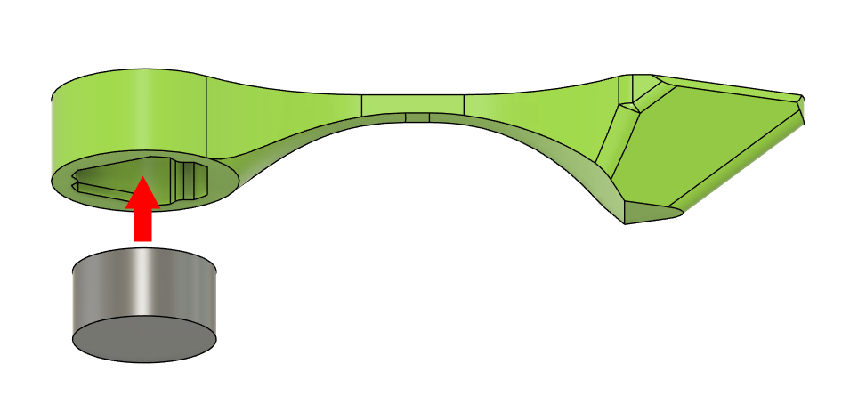

# ASABE 2024 Robotics Competition Plant
This repository contains the files needed to print (and possibly modify for tolerancing) the simulation plant for the 2024 ASABE robotics competition. **Full rules can be found [here](https://docs.google.com/document/d/1JPMAodRuwTGvhz5UEUWVJHI-WIk5GcbBl3c8BVmr7d0/edit)**

# Terminology
| Term  | Definition                                                                      |
| ----- | ------------------------------------------------------------------------------- |
| Stalk | The central core which fits into the game board and holds stems                 |
| Stem  | The part that connects the stalk and leaves/flowers. It holds a 6mmx3mm magnet. |

# Assembly
Note: Quantities are provided as recommendations for a *fully populated **average** arena*. This is not necessarily indicative of the competition arena. For more information, see section 3 of [Performance Scoring](https://docs.google.com/document/d/1JPMAodRuwTGvhz5UEUWVJHI-WIk5GcbBl3c8BVmr7d0/edit#heading=h.e97s3mxjygqm)
| Component                             | Quantity | Link                                                                                                 |
| ------------------------------------- | -------- | ---------------------------------------------------------------------------------------------------- |
| White PETG Filament                   | 1        | [Amazon](https://www.amazon.com/OVERTURE-Filament-Consumables-Dimensional-Accuracy/dp/B07PDV9RC8/)   |
| 6x3mm Neodymium Magnet                | 200      | [Amazon](https://www.amazon.com/MIN-CI-Refrigerator-Whiteboard-Decorative/dp/B096LZNZTQ/?th=1)       |
| Flat Head Thumb Tack (8/9mm Diameter) | 200      | [Amazon](https://www.amazon.com/Piutouyar-Upholstery-Furniture-Headboards-9-5mmx10mm/dp/B0BBVJT4RH/) |
| Stalk                                 | 24       | [Beginner](Beginner/Beginner_Trunk.stl)/[Advanced](Advanced/Advanced_Trunk.stl)                      |
| Stem (Short)                          | 64       | [STL](Stem_Short.stl)                                                                                |
| Stem (Medium)                         | 64       | [STL](Stem_Medium.stl)                                                                               |
| Stem (Long)                           | 64       | [STL](Stem_Long.stl)                                                                                 |
| Leaves                                | 64       | [STL](Leaves.stl)                                                                                    |
| Flower                                | 64       | [STL](Flower.stl)                                                                                    |
| Spray Paint (Healthy Leaf/Stem/Stalk) | 1        | ...TODO (Green)                                                                                      |
| Spray Paint (Unhealthy Leaf)          | 1        | ...TODO (Yellowish)                                                                                  |

## Instructions
1. Print stalks, leaves, flowers, and stems using white PETG filament. 
   1. If desired, CAD files may be modified as needed to achieve reliable press fits in the steps below (given your printer / material).
   2. The quantities provided in the component table provide our recommendation for a full field's worth of plants. **We recommend printing one of each part first to validate tolerances before printing more.**
   3. A full field will consist of *up to* 192 total stems. *For testing*, we recommend equally distributing this total among the three provided sizes (64 short, 64 medium, 64 long). Note that the actual distribution will **not** be announced.

2. Press a 6x3mm magnet into the bottom of each stem. 
3. Spray paint all components. 
   1. Leaves should be roughly split between the "healthy" and "unhealthy" color.
   2. Stems and stalks should be painted the "healthy" color
   3. Both sides of all components should be painted. We recommend painting all components at the same time.
4. Press a thumb tack into the bottom of every flower and leaf. Some light hammering might be required. 
5. Trim thumb tack stickout using diagonal cutters. 
   1. **WEAR SAFETY GLASSES!! - Trimmed pieces can fly in unpredictable directions.**
6. Glue assembled stems into the stalks according to your own discretion. 
   1. Each stalk should have 6-8 attached stems.
   2. The competition distribution will not be announced. Try to vary lengths and positions to maximize testing effectiveness.
   3. See the [advanced](https://a360.co/3RiKY86) and [beginner](https://a360.co/4aaLmyi) assemblies for an example.
7. Congratulations! Your plant(s) are now be assembled! Good luck, and we look forward to seeing you at the 2024 ASABE Robotics Competition!

# Division Differences
The competition is split into two divisions. More information about the differences between these two can be found in the 2024 release.

## Beginner [(Rules)](https://docs.google.com/document/d/1JPMAodRuwTGvhz5UEUWVJHI-WIk5GcbBl3c8BVmr7d0/edit#heading=h.k9yfkjzcqhdu)
Example Assembly: https://a360.co/4aaLmyi

For the beginner division, all stems are placed on the same level.

## Advanced [(Rules)](https://docs.google.com/document/d/1JPMAodRuwTGvhz5UEUWVJHI-WIk5GcbBl3c8BVmr7d0/edit#heading=h.tlkuhso64f3s)

Example Assembly: https://a360.co/3RiKY86

For the advanced division, both the vertical and radial position of a given leaf or flower can vary. Stem radii can vary from 1.2" - 2.25" from the center of the stalk. Depending on the plant's position within the field, the height of the stem can also vary from between 2.75" - 7.25" above the arena surface. *For specific and up-to-date information, see [section 10 of the advanced division rules](https://docs.google.com/document/d/1JPMAodRuwTGvhz5UEUWVJHI-WIk5GcbBl3c8BVmr7d0/edit#heading=h.tlkuhso64f3s)*

